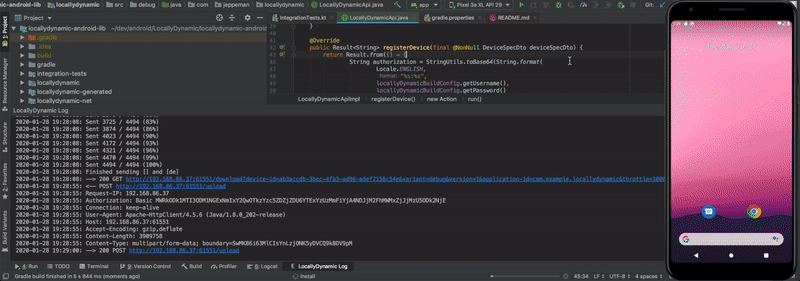
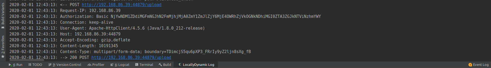
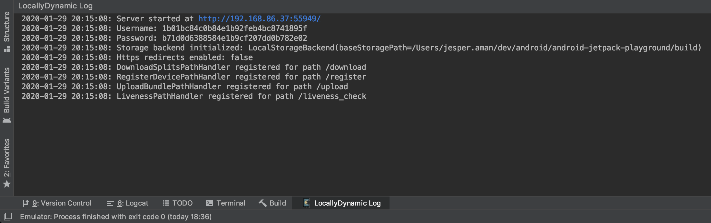

# LocallyDynamic - Dynamic Delivery without Google Play
[](https://circleci.com/gh/jeppeman/LocallyDynamic)
<p align="center">
    
</p>

**A set of tools that work in concert to facilitate dynamic delivery for Android without needing to upload app bundles to Google Play. 
<br/>It consists of the following high level components:**
* A lightweight portable <a href="locallydynamic-server-library">http server library</a> which acts as a replacement for Google Play by receiving app bundles and using the <a href="https://developer.android.com/studio/command-line/bundletool">bundletool</a> to generate and serve split APK:s to clients
* An <a href="locallydynamic-studio-plugin">Android Studio plugin</a> which embeds the above mentioned server, allowing for a smooth developer experience as well as server monitoring within your IDE
* A <a href="locallydynamic-gradle-plugin">gradle plugin</a> which hooks into the bundle build process of the android gradle plugin and uploads produced bundles to the server
* An <a href="locallydynamic-android-lib">android library</a> which downloads and installs split APK:s from the server while exposing the same API as the <a href="https://developer.android.com/guide/playcore">Play Core library</a> does.

<p align="center">
    
</p>

Why?
---
Dynamic delivery is great, it can contribute a lot towards saving space as well as data for users, however, it has the following drawbacks:
* **Restrictive**: it can only be used with devices where the Play Store app is installed, moreover, to use it with a bundle it with has to
be uploaded to the Google Play store. This makes it impossible to use dynamic delivery for internally distributed builds before they are promoted to Google Play.

* **Not a great developer experience**: since bundles have to be uploaded to Google Play, the iteration speed during development is slow. 
It is also not very flexible if you want to be able to use dynamic delivery for multiple versions simultaneously. 
Uploaded bundles also can not be debuggable, making it harder to diagnose problems.

*LocallyDynamic is an attempt at addressing these issues while maintaining good cohesion with the Play Core library.* 

Key capabilities and benefits
---
* **Local dynamic delivery**: download and install dynamic feature APK:s, language APK:s and density APK:s from an actual server running locally in Android Studio while developing, 
without having to upload bundles to Google Play
* **Dynamic delivery on any device**: utilize dynamic delivery for devices that don't/can't have the Google Play app installed
* **Dynamic delivery for internal builds**: utilize dynamic delivery for internally distributed builds before they get promoted to Google Play 
* **Dynamic delivery for debuggable builds**: utilize dynamic delivery with debuggable builds; this is not possible with Google Play
* **End to end tests for dynamic delivery**: run dynamic delivery end to end tests on your CI; see this project's CI for an example - it runs end to end tests against a LocallyDynamic server running on GCP
* **Throttle the download speed of split APK:s**: this allows for things such as testing cancellation of installations through the system notifications as well as easier testing of your dynamic delivery flow as a whole
* **<a href="https://developer.android.com/guide/playcore">Play Core Library</a> cohesion**: seamlessly switch between the Play Core library and LocallyDynamic depending on build type, without making changes to your code -  
the android library is distributed with debug/release artifacts where the debug talks to the LocallyDynamic server and the release just delegates to the Play Core library
* **Fine grained versioning on server**: a bundle is identified by three parameters on the server: application id, version code and build variant - this allows for
having multiple versions of the same application active on the server simultaneously without changing the application id. For example, you can have
debug and release versions with the sample application id and version code active at the same time.
* **Server portability**: run the LocallyDynamic server in Android Studio, in the cloud, a dedicated machine on your network or anywhere where java is available basically
* **Java and Kotlin compatibility**: the android library works for both kotlin and pure java consumers

Getting started
---
For minimal setup with an Android Studio embedded server, start by installing the <a href="https://plugins.jetbrains.com/plugin/13645-locallydynamic">LocallyDynamic Android Studio plugin</a>.<br/><br/>
Then configure the `build.gradle` of your base application module as follows:
```gradle
buildscript {
    repositories {
        maven {
            url "https://plugins.gradle.org/m2"
        }
    }
    dependencies {
        classpath "com.android.tools.build:gradle:3.5.3" // Compatible with 3.5 and above
        classpath "com.jeppeman.locallydynamic.gradle:plugin:0.1"
    }
}

apply plugin: 'com.android.application'
apply plugin: 'com.jeppeman.locallydynamic'

android {   
    buildTypes {
        debug {
            // You can have a separate configuration for each build type.
            // When locallyDynamic.serverUrl is empty  (as seen below), the plugin will use the server
            // that is embedded in Android Studio if it is running
            locallyDynamic {
                enabled = true
                throttleDownloadBy = 1000 // Optional: throttles the download speed of split APK:s by the amount of milliseconds given
            }
        }
    }
}

repositories {
    mavenCentral()
}

dependencies {
    // The debug artifact will talk to the LocallyDynamic server
    debugImplementation 'com.jeppeman.locallydynamic:locallydynamic-debug:0.1'
    
    // The release artifact will only delegate to the Play Core library
    releaseImplementation 'com.jeppeman.locallydynamic:locallydynamic:0.1'     
}
```

Then use the android library as follows:

```kotlin
import com.jeppeman.locallydynamic.LocallyDynamicSplitInstallManagerFactory

val splitInstallManager: SplitInstallManager = LocallyDynamicSplitInstallManagerFactory.create(context)
/*
Note: in the release artifact LocallyDynamicSplitInstallManagerFactory.create(context) 
will just delegate to SplitInstallManagerFactory.create(context) - no need to modify the code
between debug / release builds
*/

// Use it as you would normally use a SplitInstallmanager 
val request = SplitInstallRequest.newBuilder()
    .addModule("mymodule")
    .addLanguage(Locale.forLanguageTag("de"))
    .build()
    
splitInstallManager.registerListener(...)
splitInstallManager.startInstall(request)
```

Finally install the base APK from an app bundle that has been produced by the Android Gradle Plugin, for example:
* `./gradlew installDebug`
<br/><br/>or
* Run the app from Android Studio with the deploy option "APK from app bundle" selected: 

The bundle should now have been uploaded to the server running inside Android Studio, if it was, you should see something like
the following in the LocallyDynamic Log tool window in Android Studio:

<p align="left">
    
</p>

You can then start downloading split APK:s from your android application.

For more configuration options and different setups, e.g. running with a LocallyDynamic server somewhere else than in Android Studio, see the README:s of the <a href="locallydynamic-server-library">server library</a> and the <a href="locallydynamic-gradle-plugin">gradle plugin</a>.
<br/><br/>
You can also have a look at the <a href="locallydynamic-android-lib/sample">android sample project</a> as well as the <a href="locallydynamic-android-lib/integration-tests">android integration tests project</a> for example setups.

Compatibility
---
Compatible with Android Studio 3.5 and 3.6 as well as the Android Gradle Plugin 3.5 and 3.6 (support for 4 is coming soon)

Limitations
---
* **User confirmation**: since the installation of split APK:s are being done from the app that is running, user confirmation is required in order
to complete the installation - if you want silent installs, you can make the app a <a href="http://florent-dupont.blogspot.com/2015/01/android-shell-command-dpm-device-policy.html">device owner</a> or run on a rooted device.
* **Deferred methods**: Currently the `deferred` methods of `SplitInstallManager` (e.g. `SplitInstallManager#deferredInstall()`) are not implemented,
support for these will be added in the future.
* **API level < 21**: LocallyDynamic currently does not work for pre lollipop, support might be added in the future.
* **Live updates for API level < 24**: installation without restarting the app is only available for API level 24 (Nougat) and above; for API level >= 21 && < 24 the app will be restarted
after an installation of split APK:s have been performed  

Troubleshooting
---
If things aren't working as expected, the cause can hopefully be found in either the server logs or LogCat; the Android Studio plugin includes
a tool window on the bottom named LocallyDynamic Log where all requests and server errors will be logged - it looks as follows:
<p align="left">
    
</p>

Any operation carried out by the android library is logged under the tag `I/LocallyDynamic`, filter on it to find any errors produced.

If you have trouble reaching the server from your app, make sure that your machine is reachable on your network.
If you have a Samsung with Secure WiFi, http requests to the server may be blocked by it, if so, disable Secure WiFi.

License
---
```
Copyright 2019 Jesper Åman

Licensed under the Apache License, Version 2.0 (the "License");
you may not use this file except in compliance with the License.
You may obtain a copy of the License at

    http://www.apache.org/licenses/LICENSE-2.0

Unless required by applicable law or agreed to in writing, software
distributed under the License is distributed on an "AS IS" BASIS,
WITHOUT WARRANTIES OR CONDITIONS OF ANY KIND, either express or implied.
See the License for the specific language governing permissions and
limitations under the License.
```