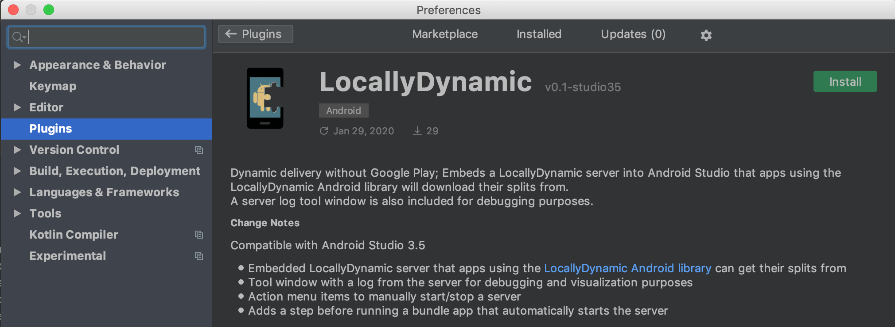
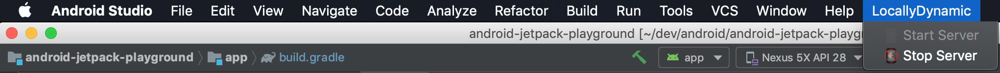

# locallydynamic-studio-plugin
An Android Studio plugin that embeds a <a href="../locallydynamic-server-library">LocallyDynamic server</a> that apps can download
split APK:s from during development.

Usage
---
Download it from <a href="https://plugins.jetbrains.com/plugin/13645-locallydynamic">here</a>, in Android Studio search for
"LocallyDynamic" in plugins and you should see:

    

Features
---
### Server Log
The plugin includes a tool window that displays logs from the LocallyDynamic server, for example requests and server errors.
It looks like this:

    

This is useful in order to make sure that the interactions between an app and the server is working as expected.

### Server menu items
A LocallyDynamic group is added to the top menu, this has items for manually starting or stopping the LocallyDynamic server.
It looks like this:

    

Normally you do not need to use this since the server is started automatically (see next section); however, it can be useful 
if you want to test behavior in your app when connection can not be established with the server.

### Automatic server starting before running an app with LocallyDynamic enabled
If LocallyDynamic is enabled for a project and build type, the plugin will automatically start the server before
running the app.
